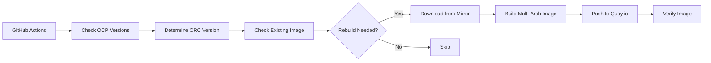
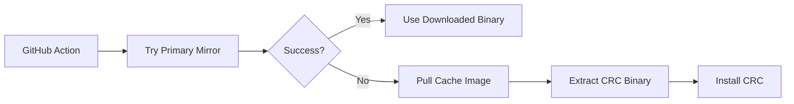

# quick-ocp-cache

> A failover caching system for CRC (CodeReady Containers) binaries and bundles

This repository provides a reliable failover mechanism for downloading CRC binaries and OpenShift bundles when the primary Red Hat mirrors are unavailable. It builds and maintains container images on Quay.io with cached CRC resources for multiple OpenShift versions.

## 📚 Table of Contents

- [Quick Start](#-quick-start)
- [Features](#-features)
- [Available Images](#-available-images)
- [How It Works](#️-how-it-works)
- [Setup Guide](#-setup-guide)
- [Usage Examples](#-usage-examples)
- [Building Locally](#️-building-locally)
- [Testing](#-testing)
- [Project Structure](#-project-structure)
- [Workflow Triggers](#-workflow-triggers)
- [Troubleshooting](#-troubleshooting)
- [Maintenance](#-maintenance)

## 🚀 Quick Start

### For Users (Using the Cache)

```bash
# Clone the repository
git clone https://github.com/palmsoftware/quick-ocp-cache.git
cd quick-ocp-cache

# Download CRC from cache (OpenShift 4.19)
./scripts/download-from-cache.sh 4.19

# Verify installation
crc version

# Setup and start CRC
crc setup
crc start
```

### For Administrators (Setting Up the System)

```bash
# 1. Configure Quay.io credentials
gh secret set QUAY_USERNAME  # Enter: username+robotname
gh secret set QUAY_TOKEN     # Paste your robot token

# 2. Build cache for OCP 4.19
gh workflow run build-crc-cache.yml -f ocp_version=4.19

# 3. Watch the build
gh run watch

# 4. Test the cache
./scripts/test-cache.sh 4.19
```

## ✨ Features

- **🔄 Automatic Nightly Builds** - GitHub Actions workflow builds fresh cache images nightly
- **🏗️ Multi-Architecture Support** - Supports both `amd64` and `arm64` (Apple Silicon)
- **🎯 Version-Specific Caches** - Separate images for each OpenShift version (4.18, 4.19, 4.20, etc.)
- **🧠 Smart Rebuilds** - Only rebuilds when CRC version changes, saving time and resources
- **📦 Complete Package** - Includes both CRC binary and corresponding OpenShift bundle
- **🔍 Rich Metadata** - JSON metadata with versions, sizes, URLs, and build timestamps
- **🛡️ Failover Ready** - Easy integration into GitHub Actions as a fallback mechanism

## 📦 Available Images

All images are hosted at: **`quay.io/bapalm/quick-ocp-cache`**

| Tag | OCP Version | CRC Version | Architectures |
|-----|-------------|-------------|---------------|
| `4.18` | 4.18 | [2.51.0](https://github.com/crc-org/crc/releases/tag/v2.51.0) | amd64, arm64 |
| `4.19` | 4.19 | [2.54.0](https://github.com/crc-org/crc/releases/tag/v2.54.0) | amd64, arm64 |
| `4.20` | 4.20 | [2.56.0](https://github.com/crc-org/crc/releases/tag/v2.56.0) | amd64, arm64 |
| `latest` | 4.20 | 2.56.0 | amd64, arm64 |

### Image Contents

Each cache image contains:

```
/cache/
├── crc-binary.tar.xz      # CRC binary archive
├── bundle.crcbundle        # CRC OpenShift bundle
├── metadata.json           # Build metadata
├── crc_version.txt         # CRC version string
├── bundle_name.txt         # Original bundle filename
├── binary_name.txt         # Original binary filename
├── arch_name.txt          # Architecture identifier
└── extract.sh             # Extraction helper script
```

## 🏗️ How It Works

### Build Process (Nightly)



### Failover Usage



## 🔧 Setup Guide

### Prerequisites

- GitHub repository access
- Quay.io account
- GitHub Actions enabled
- Docker installed locally (for testing)

### Step 1: Configure Quay.io Repository

1. **Create a Quay.io repository:**
   - Go to https://quay.io/repository/
   - Click "Create New Repository"
   - Name: `quick-ocp-cache`
   - Visibility: Public (recommended) or Private
   - Click "Create Public Repository"

2. **Create a Robot Account** (for GitHub Actions):
   - Go to your repository settings in Quay.io
   - Navigate to "Robot Accounts" tab
   - Click "Create Robot Account"
   - Name: `github_actions` (or similar)
   - Give it **Write** permissions to the repository
   - Save the credentials (you'll need them for GitHub secrets)

### Step 2: Configure GitHub Secrets

Add the following secrets to your GitHub repository:

1. Go to your GitHub repository
2. Navigate to **Settings** → **Secrets and variables** → **Actions**
3. Add the following secrets:

   - **`QUAY_USERNAME`**: Your Quay.io robot account username
     - Format: `<your-username>+<robot-name>`
     - Example: `bapalm+github_actions`
   
   - **`QUAY_TOKEN`**: Your Quay.io robot account token
     - This is the password/token provided when you created the robot account

**Using GitHub CLI:**
```bash
gh secret set QUAY_USERNAME
# Enter your robot username when prompted

gh secret set QUAY_TOKEN
# Paste your robot token when prompted
```

### Step 3: Configure OCP Versions

Edit `ocp-versions.json` to specify which OpenShift versions to cache:

```json
{
  "versions": [
    "4.18",
    "4.19",
    "4.20"
  ]
}
```

### Step 4: Test the Workflow

```bash
# Build all configured versions
gh workflow run build-crc-cache.yml

# Or build a specific version
gh workflow run build-crc-cache.yml -f ocp_version=4.19

# Force rebuild even if image exists
gh workflow run build-crc-cache.yml -f ocp_version=4.19 -f force_rebuild=true

# Monitor the workflow
gh run watch
```

### Step 5: Verify the Build

```bash
# Pull the image
docker pull quay.io/bapalm/quick-ocp-cache:4.19

# View metadata
docker run --rm quay.io/bapalm/quick-ocp-cache:4.19 cat /cache/metadata.json | jq .

# Run the test suite
./scripts/test-cache.sh 4.19

# Test both architectures
./scripts/test-cache.sh 4.19 amd64
./scripts/test-cache.sh 4.19 arm64
```

### Adding New OCP Versions

1. Update `ocp-versions.json`:
   ```json
   {
     "versions": ["4.18", "4.19", "4.20", "4.21"]
   }
   ```

2. Update the Dockerfile CRC version mapping:
   ```dockerfile
   case "${OCP_VERSION}" in \
       "4.18") CRC_VERSION="2.51.0" ;; \
       "4.19") CRC_VERSION="2.54.0" ;; \
       "4.20") CRC_VERSION="2.56.0" ;; \
       "4.21") CRC_VERSION="2.58.0" ;; \
       *) echo "Fetching latest..." ;; \
   esac
   ```

3. Commit and build:
   ```bash
   git add ocp-versions.json Dockerfile
   git commit -m "Add OCP 4.21 support"
   git push
   gh workflow run build-crc-cache.yml -f ocp_version=4.21
   ```

## 📖 Usage Examples

### Using the Download Script

```bash
# Download and install CRC from cache (OCP 4.19)
./scripts/download-from-cache.sh 4.19

# Specify architecture (default: amd64)
./scripts/download-from-cache.sh 4.19 quay.io arm64

# Verify installation
crc version
```

### Manual Docker Commands

```bash
# Pull the cache image
docker pull quay.io/bapalm/quick-ocp-cache:4.19

# View metadata
docker run --rm quay.io/bapalm/quick-ocp-cache:4.19 cat /cache/metadata.json

# Create a container
CONTAINER_ID=$(docker create quay.io/bapalm/quick-ocp-cache:4.19)

# Extract CRC binary
docker cp $CONTAINER_ID:/cache/crc-binary.tar.xz ./crc.tar.xz
tar -xvf crc.tar.xz

# Extract bundle (optional)
BUNDLE_NAME=$(docker run --rm quay.io/bapalm/quick-ocp-cache:4.19 cat /cache/bundle_name.txt)
docker cp $CONTAINER_ID:/cache/bundle.crcbundle ./$BUNDLE_NAME

# Install CRC
sudo mv crc-linux-*/crc /usr/local/bin/
chmod +x /usr/local/bin/crc

# Cleanup
docker rm $CONTAINER_ID
```

### GitHub Actions Integration

#### Basic Failover Pattern

```yaml
- name: Download CRC with failover
  run: |
    # Try primary Red Hat mirror first
    if ! curl -L -f --retry 3 --retry-delay 5 \
         -o crc.tar.xz \
         https://developers.redhat.com/content-gateway/rest/mirror/pub/openshift-v4/clients/crc/2.54.0/crc-linux-amd64.tar.xz; then
      echo "Primary mirror failed, using Quay cache..."
      ./scripts/download-from-cache.sh 4.19
    else
      tar -xvf crc.tar.xz
      sudo mv crc-linux-*/crc /usr/local/bin/
    fi

- name: Verify CRC installation
  run: |
    crc version
    which crc
```

#### Advanced: Version-Specific Fallback

```yaml
jobs:
  setup-crc:
    runs-on: ubuntu-latest
    strategy:
      matrix:
        ocp_version: ["4.18", "4.19", "4.20"]
    
    steps:
      - name: Checkout
        uses: actions/checkout@v4
      
      - name: Download CRC with failover
        env:
          OCP_VERSION: ${{ matrix.ocp_version }}
        run: |
          # Determine CRC version from OCP version
          case "$OCP_VERSION" in
            "4.18") CRC_VERSION="2.51.0" ;;
            "4.19") CRC_VERSION="2.54.0" ;;
            "4.20") CRC_VERSION="2.56.0" ;;
          esac
          
          # Try primary mirror
          MIRROR_URL="https://developers.redhat.com/content-gateway/rest/mirror/pub/openshift-v4/clients/crc/${CRC_VERSION}/crc-linux-amd64.tar.xz"
          
          if curl -L -f --retry 3 --retry-delay 5 -o crc.tar.xz "$MIRROR_URL"; then
            echo "Downloaded from primary mirror"
            tar -xvf crc.tar.xz
            sudo mv crc-linux-*/crc /usr/local/bin/
          else
            echo "Primary mirror failed, using cache"
            ./scripts/download-from-cache.sh "$OCP_VERSION"
          fi
      
      - name: Setup CRC
        run: |
          crc version
          crc setup
```

### Common Use Cases

#### 1. CI/CD Pipelines

Use as a reliable fallback when setting up CRC in CI:

```yaml
- name: Setup CRC with failover
  run: |
    if ! ./scripts/download-crc-primary.sh; then
      echo "Primary mirror unavailable, using cache"
      ./scripts/download-from-cache.sh 4.19
    fi
```

#### 2. Local Development

Keep a local copy for offline development:

```bash
# Pull image for offline use
docker pull quay.io/bapalm/quick-ocp-cache:4.19

# Later, when offline:
./scripts/download-from-cache.sh 4.19
```

#### 3. Airgapped Environments

Transfer images to airgapped environments:

```bash
# Save image to tarball
docker save quay.io/bapalm/quick-ocp-cache:4.19 -o crc-cache-4.19.tar

# Transfer to airgapped system, then load:
docker load -i crc-cache-4.19.tar

# Extract files
./scripts/download-from-cache.sh 4.19 localhost
```

#### 4. Quick Version Switching

Rapidly switch between OCP versions:

```bash
# Test with OCP 4.19
./scripts/download-from-cache.sh 4.19
crc setup
crc start

# Switch to OCP 4.20
crc stop
crc delete
./scripts/download-from-cache.sh 4.20
crc setup
crc start
```

## 🛠️ Building Locally

**Note:** The build script automatically detects and works with both **Docker** and **Podman**!

### Quick Test (Single Architecture)

```bash
# Build for your current platform (works with docker or podman)
docker build --build-arg OCP_VERSION=4.19 -t quick-ocp-cache:4.19 .
# or
podman build --build-arg OCP_VERSION=4.19 -t quick-ocp-cache:4.19 .

# Test the image
docker run --rm quick-ocp-cache:4.19 cat /cache/metadata.json
```

### Production Build (Multi-Architecture)

Using the provided script (auto-detects docker/podman):

```bash
# Build single version locally (for testing)
./scripts/build-local.sh 4.19 --multi-arch

# Build and push to Quay.io
./scripts/build-local.sh 4.19 --multi-arch --push

# Build all versions and push
./scripts/build-local.sh --all --multi-arch --push
```

**Smart Local Caching:**

The build script automatically reuses CRC bundles from your local `~/.crc/cache` directory:

- If you already have CRC bundles (e.g., `crc_vfkit_4.19.8_arm64.crcbundle`), they'll be used instead of downloading
- Downloaded bundles are saved back to `~/.crc/cache` for reuse by CRC and future builds
- Saves time and bandwidth by avoiding 5-6 GB downloads for bundles you already have

Example workflow:
```bash
# First build downloads bundles (~5 GB)
./scripts/build-local.sh 4.19 --multi-arch

# Second build reuses the same bundles (instant!)
./scripts/build-local.sh 4.19 --multi-arch

# Works with CRC's own cache too
crc setup  # Downloads bundle to ~/.crc/cache
./scripts/build-local.sh 4.19 --multi-arch  # Reuses that bundle!
```

Or manually with docker buildx or podman:

**Docker:**
```bash
# One-time setup
docker buildx create --name multiarch --use

# Build and push
docker buildx build \
  --platform linux/amd64,linux/arm64 \
  --build-arg OCP_VERSION=4.19 \
  -t quay.io/bapalm/quick-ocp-cache:4.19 \
  --push .
```

**Podman:**
```bash
# Build for both architectures
podman build --platform linux/amd64 --build-arg OCP_VERSION=4.19 \
  -t quay.io/bapalm/quick-ocp-cache:4.19-amd64 .
podman build --platform linux/arm64 --build-arg OCP_VERSION=4.19 \
  -t quay.io/bapalm/quick-ocp-cache:4.19-arm64 .

# Create and push manifest
podman manifest create quay.io/bapalm/quick-ocp-cache:4.19 \
  quay.io/bapalm/quick-ocp-cache:4.19-amd64 \
  quay.io/bapalm/quick-ocp-cache:4.19-arm64
podman manifest push quay.io/bapalm/quick-ocp-cache:4.19
```

## 🧪 Testing

### Test Mirror Availability

Before building cache images, verify the mirrors are accessible:

```bash
# Test all configured versions
./scripts/test-mirror.sh

# Test specific version
./scripts/test-mirror.sh 4.19
```

### Download Bundles to Local Cache

Pre-download CRC bundles for **both amd64 and arm64** to your local `~/.crc/cache` directory:

```bash
# Download bundles for both architectures
./scripts/download-bundle.sh 4.19

# Downloads both:
# - crc_libvirt_4.19.x_amd64.crcbundle (~6GB)
# - crc_vfkit_4.19.x_arm64.crcbundle (~6GB)
```

This is useful for:
- Pre-populating your local CRC cache before multi-arch builds
- Avoiding repeated downloads during development
- Working offline after initial download
- Building images for both architectures on a single machine

### Test Cache Images

Run the comprehensive cache test suite:

```bash
# Test default version (4.19) on amd64
./scripts/test-cache.sh

# Test specific version
./scripts/test-cache.sh 4.20

# Test specific version and architecture
./scripts/test-cache.sh 4.19 arm64
```

### Manual Verification

```bash
# Check image size
docker images quay.io/bapalm/quick-ocp-cache

# View all metadata
docker run --rm quay.io/bapalm/quick-ocp-cache:4.19 cat /cache/metadata.json | jq .

# Check file sizes
docker run --rm quay.io/bapalm/quick-ocp-cache:4.19 ls -lh /cache/

# Verify extraction script works
docker run --rm quay.io/bapalm/quick-ocp-cache:4.19 /cache/extract.sh /tmp/test
```

## 🔧 Project Structure

```
quick-ocp-cache/
├── Dockerfile                          # Parameterized multi-stage Dockerfile
├── ocp-versions.json                   # OCP version configuration
├── .github/
│   └── workflows/
│       └── build-crc-cache.yml        # Nightly build workflow
├── scripts/
│   ├── download-from-cache.sh         # Failover download script
│   ├── download-bundle.sh             # Download bundles to local cache
│   ├── test-cache.sh                  # Cache image test suite
│   ├── test-mirror.sh                 # Mirror availability test suite
│   └── build-local.sh                 # Local build helper script
└── README.md                           # This file
```

## 🔄 Workflow Triggers

The build workflow can be triggered in three ways:

1. **Scheduled (Nightly):**
   - Runs at 2 AM UTC every day
   - Checks all configured OCP versions
   - Only rebuilds if CRC version changed

2. **Manual (Build All):**
   ```bash
   gh workflow run build-crc-cache.yml
   ```

3. **Manual (Specific Version):**
   ```bash
   gh workflow run build-crc-cache.yml -f ocp_version=4.19
   gh workflow run build-crc-cache.yml -f ocp_version=4.19 -f force_rebuild=true
   ```

## 🔧 Troubleshooting

### Workflow Issues

#### "Failed to pull image"
**Solution:** Check your Quay.io credentials and robot account permissions.

```bash
# Verify credentials are set
gh secret list

# For private repositories, login locally
docker login quay.io
```

#### Workflow Fails During Download
**Solution:** The CRC mirror might be down. This is expected occasionally. The workflow will retry on the next run.

#### Image Size Too Large
CRC bundles are typically 3-5 GB. This is expected. Quay.io free tier supports up to 10 GB of storage.

#### Smart Rebuild Not Working
Force a rebuild manually:
```bash
gh workflow run build-crc-cache.yml -f ocp_version=4.19 -f force_rebuild=true
```

### Local Usage Issues

#### "Permission denied" installing CRC
**Solution:** Ensure you have sudo access:
```bash
sudo ./scripts/download-from-cache.sh 4.19
```

#### "Failed to pull image"
**Possible causes:**
1. Network connectivity issues
2. Private repository without login
3. Invalid image tag

**Solutions:**
```bash
# Check connectivity
docker pull hello-world

# Login to Quay (if private)
docker login quay.io

# Verify tag exists
docker pull quay.io/bapalm/quick-ocp-cache:4.19
```

#### Downloaded binary doesn't run
**Check architecture mismatch:**
```bash
# Check your system
uname -m

# Pull correct architecture
docker pull --platform linux/$(uname -m) quay.io/bapalm/quick-ocp-cache:4.19
```

#### Bundle not compatible with CRC version
1. Check the metadata: `docker run --rm <image> cat /cache/metadata.json`
2. Verify CRC and bundle versions match
3. Report the issue or rebuild the image

### Viewing Logs

```bash
# List recent workflow runs
gh run list --workflow=build-crc-cache.yml

# View logs for failed runs
gh run view <run-id> --log-failed

# Watch a running workflow
gh run watch
```

## 🔧 Maintenance

### Regular Tasks

1. **Monthly:** Review and update OCP versions
2. **Quarterly:** Clean up old images in Quay.io
3. **As needed:** Update CRC version mappings when new releases are available

### Monitoring

Check the GitHub Actions workflow runs:
```bash
gh run list --workflow=build-crc-cache.yml
```

View logs for failed runs:
```bash
gh run view <run-id> --log-failed
```

### Architecture Support

The system builds multi-architecture images supporting:
- **linux/amd64** (Intel/AMD 64-bit)
- **linux/arm64** (ARM 64-bit, including Apple Silicon)

Docker automatically pulls the correct architecture for your system.

### Performance Considerations

#### Download Times
Typical download times (with good internet):
- **Binary only**: 30-60 seconds
- **Binary + Bundle**: 5-15 minutes (bundle is 3-5 GB)

#### Disk Space
Each cache image requires:
- **Binary**: ~120 MB compressed
- **Bundle**: ~3-5 GB compressed
- **Total per version**: ~3-5 GB

#### Cost Considerations

**Quay.io Free Tier:**
- Unlimited public repositories
- Unlimited bandwidth
- 10 GB storage total

**GitHub Actions:**
- 2000 free minutes/month for private repos
- Unlimited for public repos
- Each build takes approximately 30-60 minutes per architecture

**Estimated monthly cost:** $0 (using free tiers)

## 💡 Best Practices

1. **Always try primary mirror first** - Use cache as fallback only
2. **Pin to specific OCP versions** - Don't rely on `latest` in production
3. **Test before deploying** - Run test suite after pulling new images
4. **Monitor image freshness** - Check build dates in metadata
5. **Clean up old versions** - Remove unused local images to save space

## 🤝 Contributing

Contributions are welcome! Areas for improvement:

- Additional OCP version support
- Enhanced error handling
- Alternative registry support (GHCR, Docker Hub)
- Additional test coverage
- Documentation improvements

## 💡 Use Cases

- **CI/CD Pipelines** - Reliable CRC downloads in GitHub Actions
- **Offline Development** - Pre-cached binaries for airgapped environments
- **Disaster Recovery** - Failover when Red Hat mirrors are unavailable
- **Testing** - Quick switching between OpenShift versions
- **Education** - Consistent CRC versions for training and workshops

## 📊 Status

- ✅ Multi-architecture support (amd64, arm64)
- ✅ Smart rebuild detection
- ✅ Comprehensive test suite
- ✅ Complete documentation
- ✅ Nightly automated builds
- ✅ Metadata and versioning
- ✅ GitHub Actions integration examples

## 🔗 Related Projects

- [quick-ocp](https://github.com/palmsoftware/quick-ocp) - Main quick-ocp project
- [CRC](https://github.com/crc-org/crc) - CodeReady Containers upstream

## 📄 License

This project is part of the quick-ocp ecosystem.

## 🙏 Acknowledgments

- Red Hat for providing CRC and OpenShift
- Quay.io for reliable container registry
- GitHub Actions for CI/CD infrastructure

## 🔐 Security Notes

- Robot account tokens are sensitive - never commit them to the repository
- Use GitHub Secrets for all credentials
- Regularly rotate robot account tokens
- Monitor Quay.io access logs for suspicious activity

---

**Maintained by:** Brandon Palm (bpalm@redhat.com)  
**Status:** Production Ready  
**Last Updated:** November 2025
